# Laboratorio 02: Control de Versiones y Documentación Automática

### Tabla de contenidos
1. [Control de Versiones](#control-de-versiones)

    - [Sección Principal](#seccion-principal)

    - [Sección Remota](#seccion-remota)
2. [Documentación Automática](#documentacion-automatica)

    - [Doxygen](#doxygen)

    - [Sphinx](#sphinx)

 

## Control de Versiones

### Sección Principal

<strong>Sección Introductoria</strong>

---

| N° | Evidencia | Comandos | Descripción |
|----|-----------|----------|-------------|
| 1  | 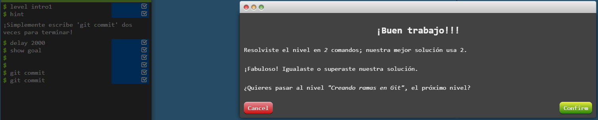 | `git commit` | Navegación entre directorios. |
| 2  | 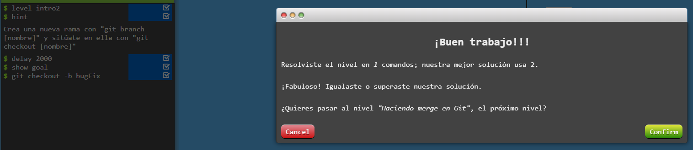 | `git branch <branch name>`     `git checkout -b <branch name>`     `git checkout <branch name>`| Crea una rama con nombre `<branch name>`     Crea una rama con nombre `<branch name>`     Cambia a una rama con nombre `<branch name>` |
| 3  | 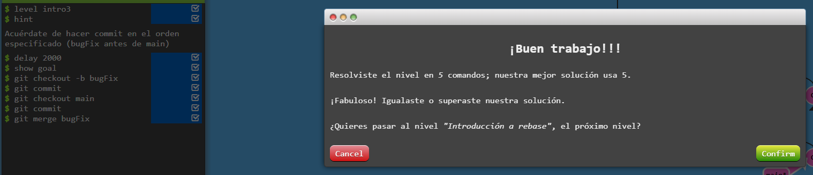 | `git merge <branch>` | Agregar commits de una rama a otra con un historial más transparente pero puede verse desorganizado. |
| 4  | 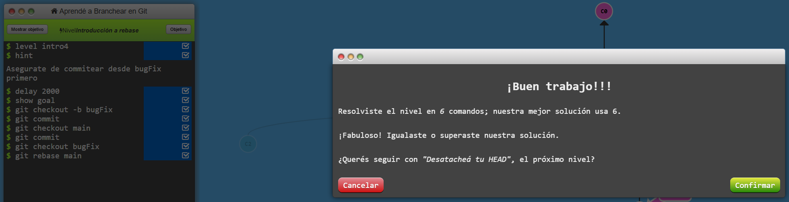 | `git rebase <branch>` |  Agregar commits de una rama otra en una secuencia lineal y organizada pero no conserva el historial original. |

 

<strong>Acelerando</strong>

---

| N° | Evidencia | Comandos | Descripción |
|----|-----------|----------|-------------|
| 5  | 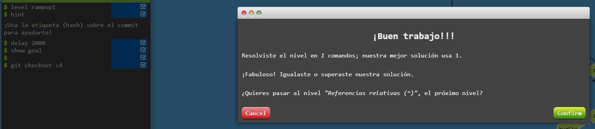 | `git checkout <commit>` | Hace un detached del HEAD, moviendolo del branch actual a un commit especifico. |
| 6  | 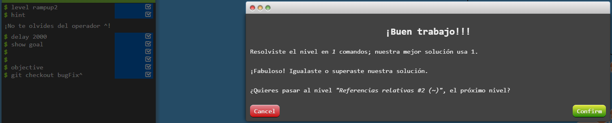 | `git checkout <branch>^` | Hace un detached del HEAD, moviendolo un commit arriba del branch actual. |
| 7  | 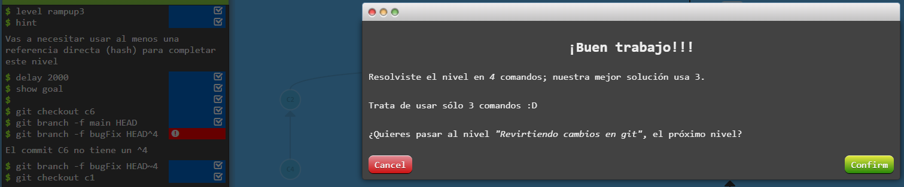 | `git branch -f main HEAD~4` | Fuerza al branch `main` a moverse cuatro commits arriba de HEAD. |
| 8  | 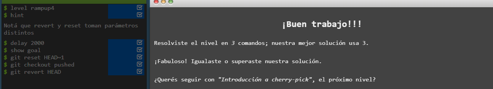 | `git reset HEAD~1`     `git revert HEAD` | Revierte el estado de la rama un commit arriba de HEAD como si nunca si hubiera hecho     Revierte el estado de la rama haciendo un nuevo commit para compartir los cambios. |

 

<strong>Working around</strong>

---

| N° | Evidencia | Comandos | Descripción |
|----|-----------|----------|-------------|
| 9  | 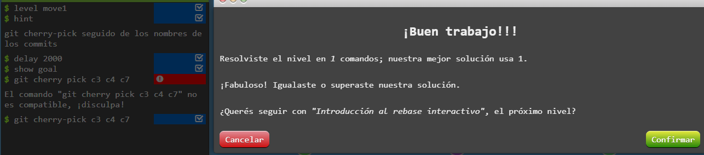 | `git cherry-pick <commit1> <commit2> ... <commit n>` | Aplica commits específicos de otras ramas. |
| 10 | 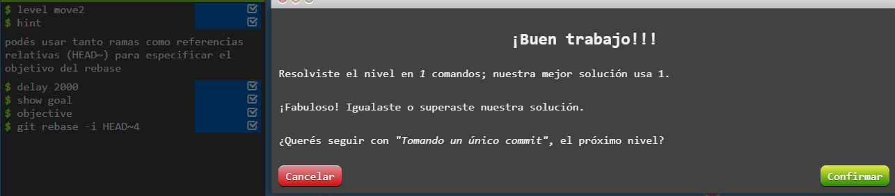 | `git rebase -i HEAD~4` | Reescribe los últimos 4 commits de forma interactiva. |

 

<strong>Un poco de todo</strong>

---

| N° | Evidencia | Comandos | Descripción |
|----|-----------|----------|-------------|
| 11 | 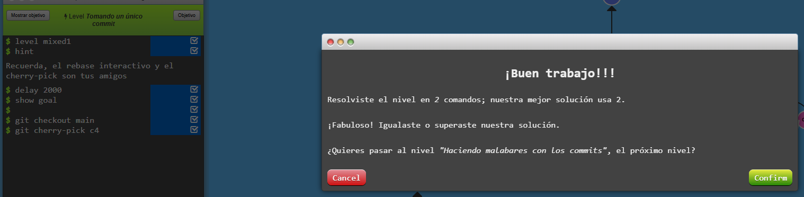 | - | - |
| 12 | 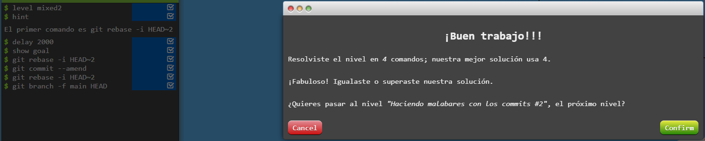 | `git commit --amend` | Modifica el último commit. |
| 13 | 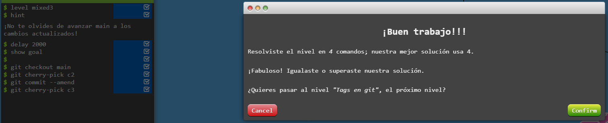 | - | - |
| 14 | 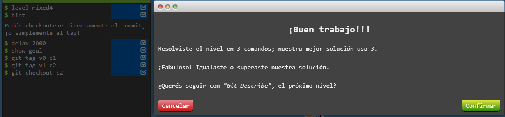 | `git tag <tag_name> <commit to tag>` | Crea una etiqueta en un commit específico. |
| 15 | 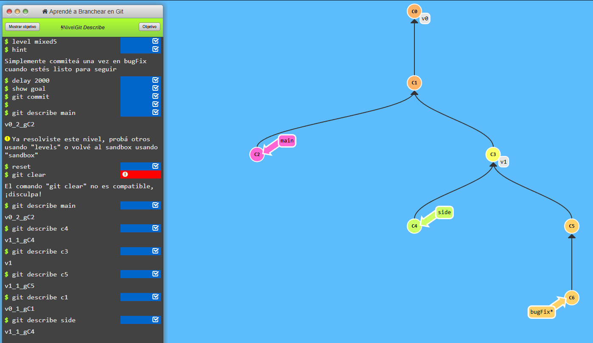 | `git describe <branch/commit>` | Transferencia de archivos entre equipos. |

 

<strong>Temas avanzados</strong>

---

| N° | Evidencia | Comandos | Descripción |
|----|-----------|----------|-------------|
| 16 | 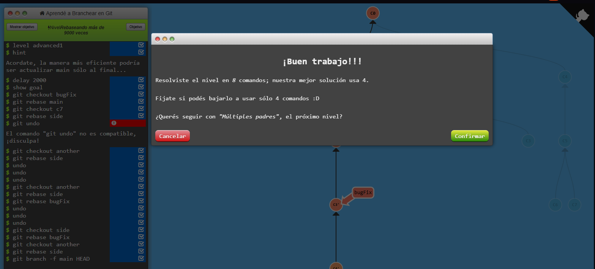 | - | - |
| 17 | 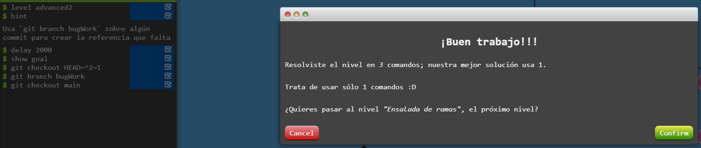 | - | - |
| 18 | 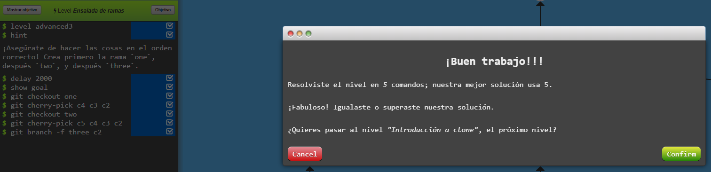 | - | - |

 

|  RESUMEN DE LOS EJERCICIOS COMPLETADOS  |
|:-----------:|
|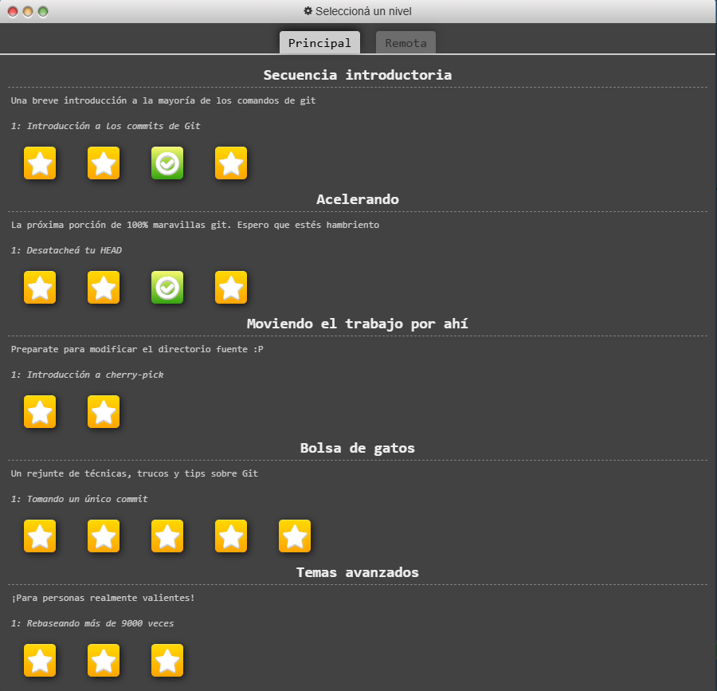 |

 

### Sección Remota

<strong>Push y Pull</strong>

---

| N° | Evidencia | Comandos | Descripción |
|----|-----------|----------|-------------|
| 1  | 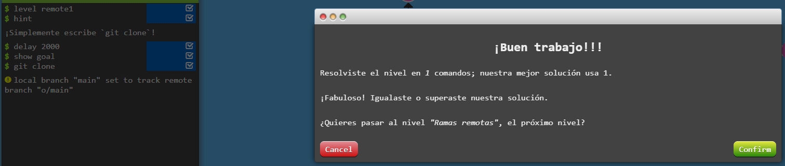 | `git clone` | Clona un repositorio remoto. |
| 2  |  | `git checkout origin/main` | Cambia a la rama remota sin crear rama local. |
| 3  | 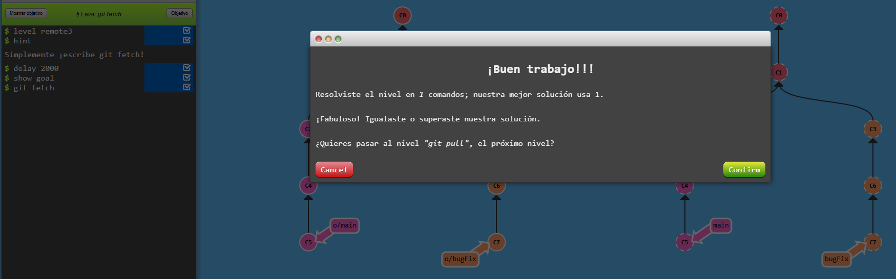 | `git fetch` | Descarga los cambios del remoto sin aplicarlos. |
| 4  | 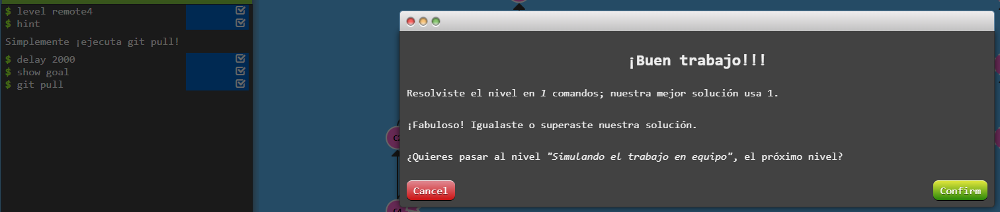 | `git pull` | Descarga y aplica cambios del remoto. |
| 5  | 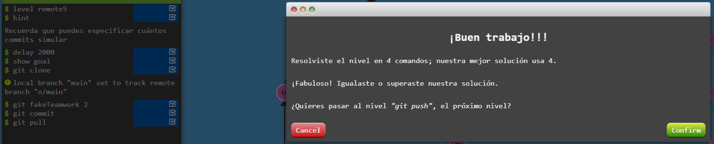 | - | - |
| 6  | 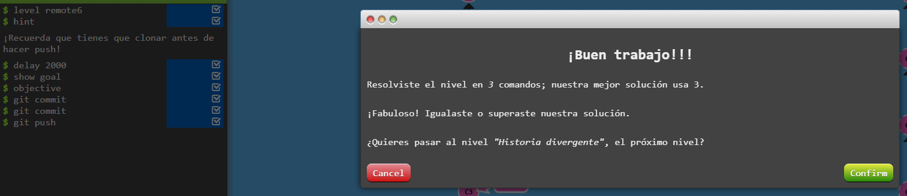 | `git push` | Envía los cambios al repositorio remoto. |
| 7  | 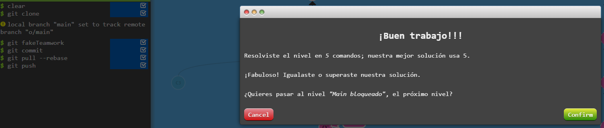 | `git pull --rebase` | Aplica los cambios remotos sobre los locales. |
| 8  | 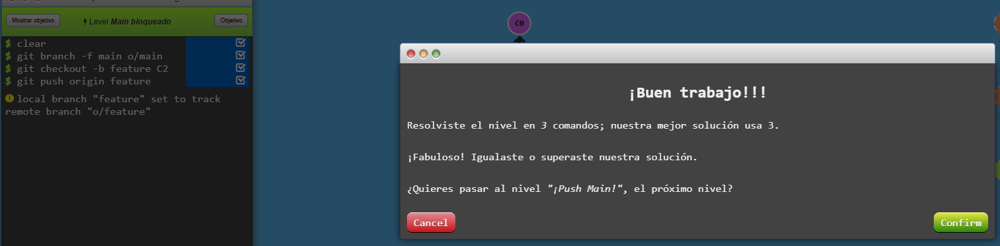 | `git branch -f main origin/main`     `git checkout -b <branch> <commit>`     `git push origin <branch>` | Fuerza una rama al estado remoto.     Crea una rama desde un commit.     Sube una nueva rama al remoto. |

 

<strong>Hasta el origen y más allá</strong>

---

| N° | Evidencia | Comandos | Descripción |
|----|-----------|----------|-------------|
| 9  | 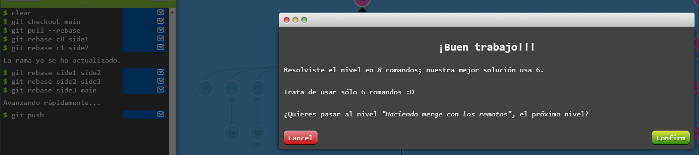 | `git rebase <local commit> <local branch>`     `git rebase <local branch> <local branch>` | Aplica los commits desde el commit indicado sobre la rama actual.     Reorganiza una rama encima de sí misma, útil para reordenar o limpiar historial. |
| 10 | 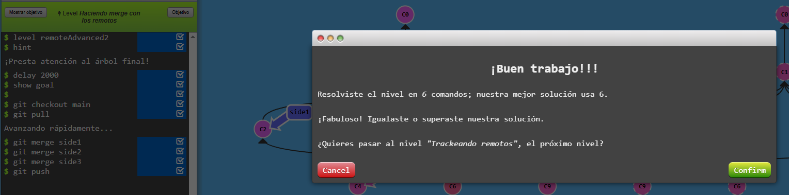 | - | - |
| 11 | 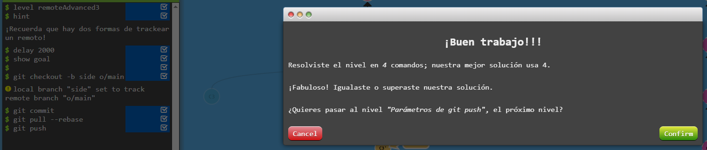 | `git checkout -b <local branch> origin/main` | Crea una nueva rama local basada en la rama remota `origin/main`. |
| 12 | 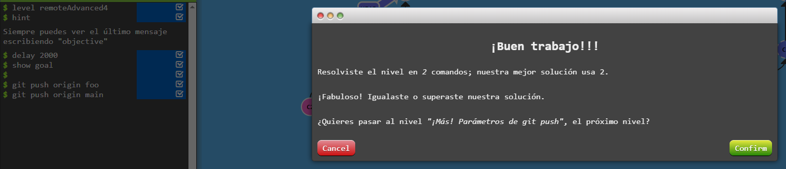 | `git push origin <local branch>` | Sube una rama local al repositorio remoto con el mismo nombre. |
| 13 | 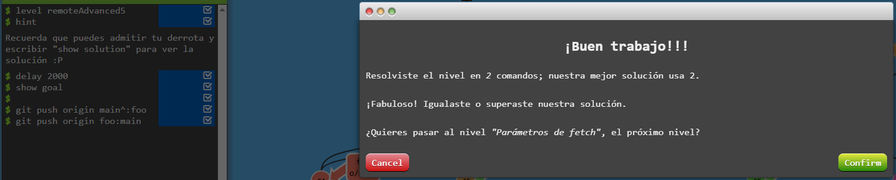 | `git push origin <local branch>:<remote branch>` | Sube una rama local al remoto, pero con un nombre diferente al local. |
| 14 | 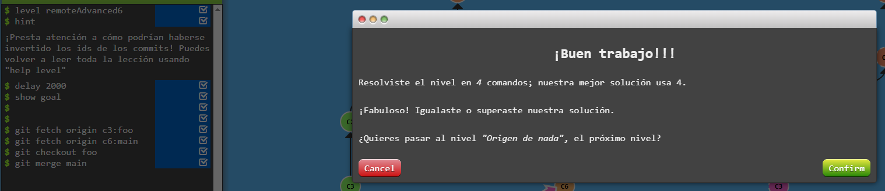 | `git fetch origin <remote branch>`     `git fetch origin <remote commit>:<local branch>` | Trae una rama remota completa y actualiza el tracking local.     Descarga un commit específico del remoto y lo guarda en una nueva rama local. |
| 15 |  | `git pull origin :<branch>`     `git fetch origin :<branch>` | Elimina la rama `<branch>` tanto local como remotamente.     Crea una rama local vacía con el nombre especificado. |
| 16 | 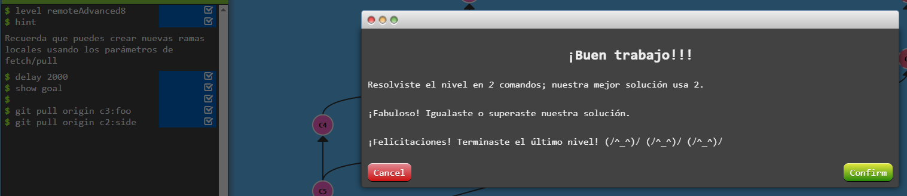 | `git pull origin <branch>`     `git pull origin <remote branch>:<local branch>`    `git pull origin <remote commit>:<local branch>` | Descarga y fusiona una rama remota con la rama actual.     Trae una rama remota y la fusiona con una rama local distinta.     Trae un commit específico del remoto y lo aplica en una rama local. |

 

|  RESUMEN DE LOS EJERCICIOS COMPLETADOS  |
|:-----------:|
|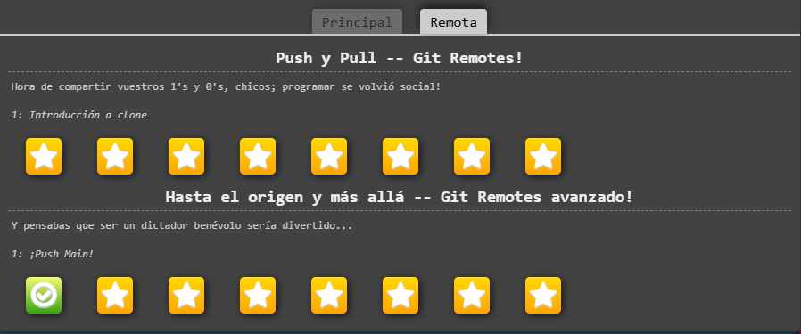 |

 

## Documentación Automática

### Doxygen
La documentación de Doxygen puede encontrarse disponible en: https://ie0417-hashtable.netlify.app/files

### Sphinx
La documentación de Sphinx puede encontrarse disponible en: https://ie0417-sismos.netlify.app/main