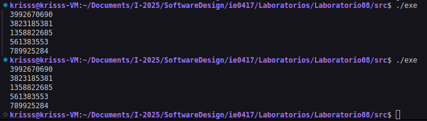
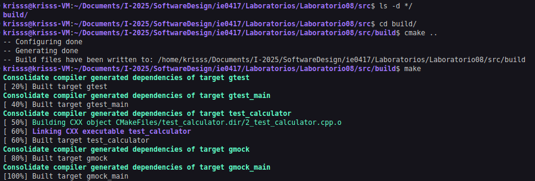
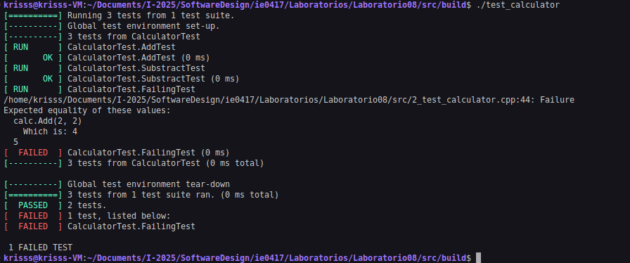
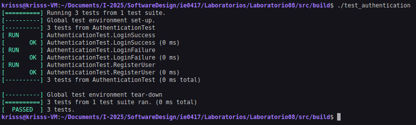
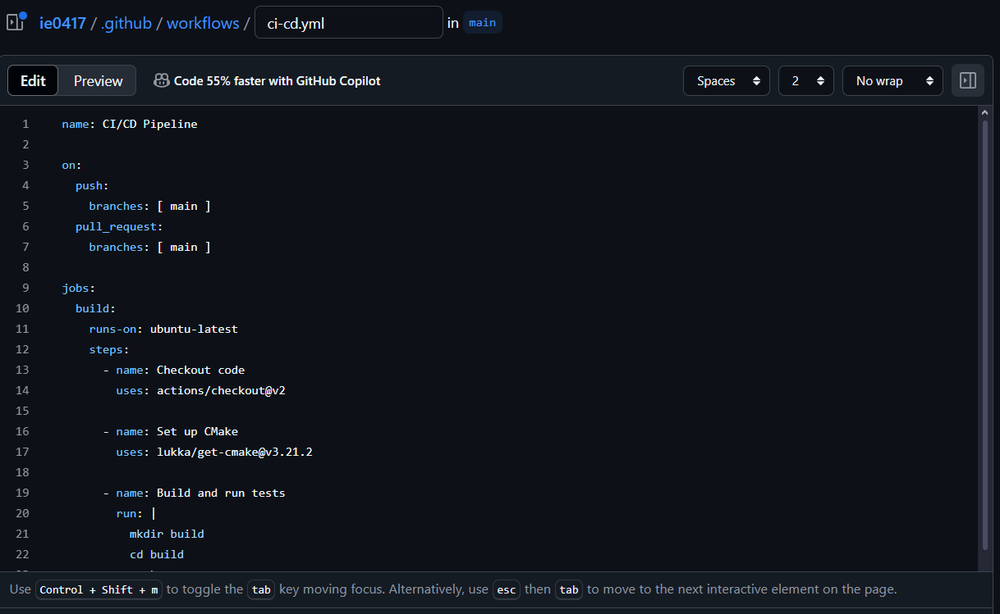
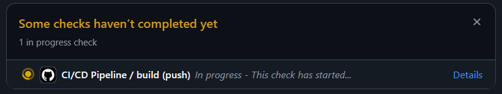
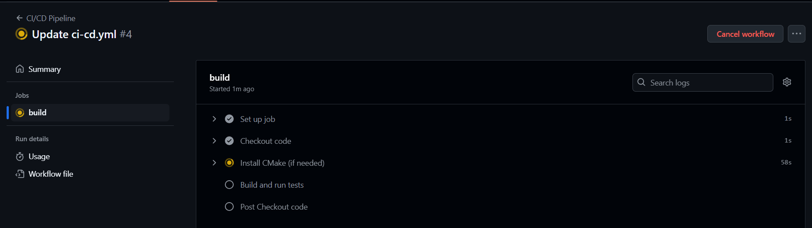
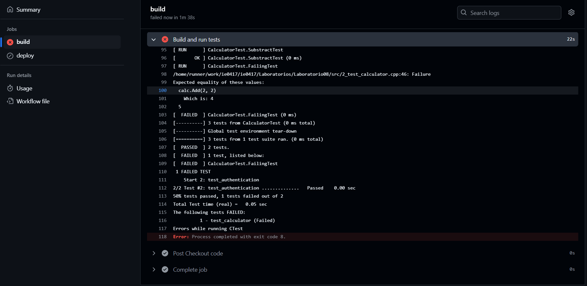
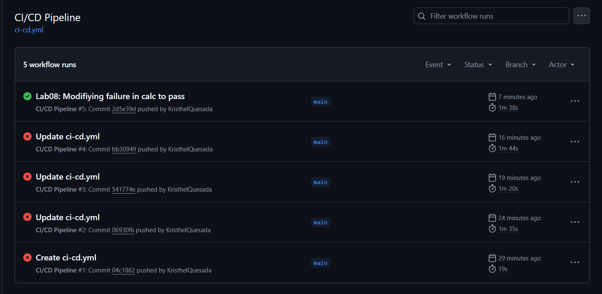

# Laboratorio 08: Software Testing

### Estudiantes:
- Gabriel Gamboa Vargas, B73098
- Kristhel Quesada López, C06153


### Tabla de contenidos

1. [Compilación y Ejecución](#1-compilación-y-ejecución)
2. [Procedimiento](#2-procedimiento)

----
<br>

## 1. Compilación y Ejecución

#### Requisitos previos
```bash
sudo apt-get update && sudo apt-get install -y cmake
```

#### Ejecutar todos los ejemplos
```bash
chmod u+x run-test.sh
```

```bash
./run-test.sh
```

> [!TIP]
> Profesor/asistente, se implementa el script anterior con la finalidad de que los ejemplos del laboratorio puedan ser ejecutados en un solo comando para su facilidad. No obstante, de requerir las pruebas por individual refierase a los comandos siguientes.

<br>

#### Ejecutar ejemplo de la semilla

```bash
g++ -o random_example random_example.cpp
```

```bash
./exe
```

#### Ejecutar ejemplos con gtest y gmock

```bash
cd src/
mkdir build
cd build/
cmake ..
make
./test_calculator
./test_authentication

<br>

<br>

## 2. Procedimiento

|  |
|:--:|
| **Figura 1. Ejemplo de la semilla.** |

|  |
|:--:|
| **Figura 2. Set-up del uso de cmake para el ejemplo de la calculadora.** |

|  |
|:--:|
| **Figura 3. Resultados del ejemplo de Unit Testing (`test_calculator`).** |

|  |
|:--:|
| **Figura 4. Resultados del ejemplo de Functional Testing (`test_authentication`).** |

|  |
|:--:|
| **Figura 5. Configuración del archivo de workflow.** |

|  |
|:--:|
| **Figura 6. Vista del workflow actual de GitHub Actions.** |

|  |
|:--:|
| **Figura 7. Vista de los logs del workflow actual de GitHub Actions.** |

|  |
|:--:|
| **Figura 8. Log del workflow tras el error inicial de `test_calculator`.** |

|  |
|:--:|
| **Figura 9. Resultado éxitoso del workflow tras correción del error inicial de `test_calculator`.** |